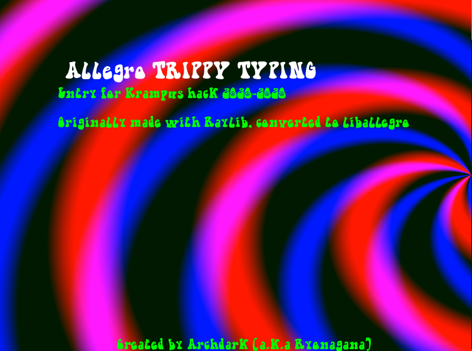
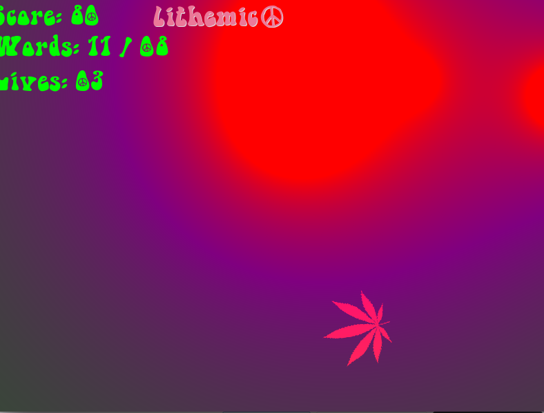

## Trippy Typing game
-- Krampus Hack 2020 Entry Originally used Raylib, converted to allegro + shaders


-- Murphy's Mushroom Farm - by  audiomirage at https://freesound.org
-- hippie trippy loop.wav - by zagi2 at https://freesound.org

### Screenshots



##How to Build

```console
foo@bar:~$ ./build.sh
foo
```
You May need to set your own path in Makefile.release
